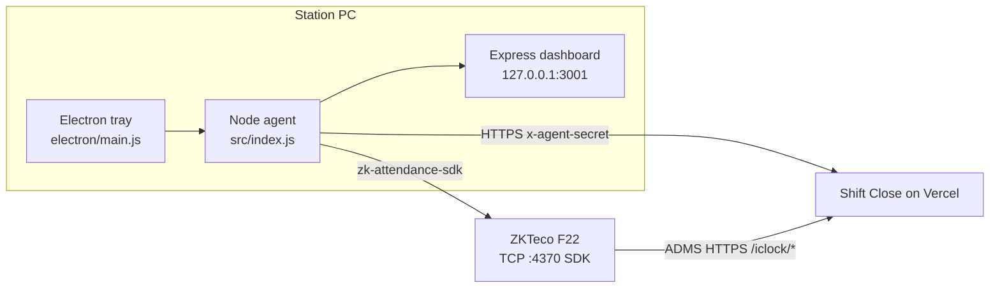

# Windows Agent — Architecture Handoff (for Simple Roster Plus)

**Audience:** Coding agents and implementers porting attendance / device bridge behavior into **Simple Roster Plus (SR+)**.

**Companion doc:** `docs/SIMPLE_ROSTER_PLUS_SOURCE_HANDOFF.md` (Staff / Roster / Attendance data model and API surface). That handoff **defers** Windows agent + full ADMS for SR+ v1; use **this** document when implementing the agent later or when capturing full context.

**Source app root:** `Shift Close/` (Next.js App Router, Prisma, PostgreSQL).  
**Agent package root:** `Shift Close/agent/` (sibling of `app/`, nested git repo `github.com/ellodanem/shift-close`).

**Package identity:** `com.westline.shiftclose.agent` / product name “Shift Close Agent” (`agent/package.json`).

---

## 0. One-sentence model

The Windows agent is a **tray-hosted Node/Electron LAN worker**: it keeps ZKTeco user slots aligned with cloud staff via secret-authenticated HTTPS polling, exposes a localhost ops UI, and leaves **real-time punches** to the device’s **ADMS/iClock HTTPS push**. It is **not** a general remote-control agent and does **not** use WebSockets, named pipes, or SignalR.

---

## 1. Purpose and role split

Cloud hosts (e.g. Vercel) cannot open TCP to a private ZKTeco F22 on `192.168.x.x`. The agent runs on a station PC that **is** on the same LAN as the terminal.

| Job | Behavior |
|-----|----------|
| **Staff → device** | Polls cloud for active staff with `deviceUserId`, pushes **missing** users onto the terminal via SDK `setUser()` |
| **Punches → cloud** | **Not automatic.** Primary path is device **ADMS/iClock** push to the cloud. Agent only does **manual** punch upload from its local dashboard |
| **Local ops UI** | Dashboard at `http://127.0.0.1:3001` (test device, discover IP, sync staff, select/upload punches, ADMS hints) |
| **Always-on presence** | Electron tray; Windows login auto-start |

Operator docs: `agent/README.md`. Cloud UI tab: Attendance → “Windows Agent” in `app/attendance/page.tsx`.

### Explicitly out of scope for the agent

- Enrolling fingerprints / biometric templates
- Deleting users from the terminal
- Real-time punch streaming (ADMS owns that)
- Remote commands from cloud → agent (no command queue)
- Auto-update / code signing (manual redistributed installer)

---

## 2. High-level architecture



### Components

| Component | Path | Role |
|-----------|------|------|
| Electron shell | `agent/electron/main.js` | Tray, BrowserWindow, login item, single-instance lock; `require`s agent **in-process** (no fork) |
| Agent runtime | `agent/src/index.js` | Starts dashboard; staff sync interval; device ping + auto-rediscovery |
| Config | `agent/src/config.js` | `agent.config.json` (+ env overrides) |
| Device SDK | `agent/src/deviceClient.js` | Wraps `zk-attendance-sdk` |
| Discovery | `agent/src/deviceDiscovery.js` | Subnet scan for port 4370 + SDK probe |
| Staff sync | `agent/src/staffSync.js` | Cloud → device users |
| Punch sync | `agent/src/attendanceSync.js` | Device pull + manual cloud POST |
| Local API/UI | `agent/src/dashboard/server.js` + `public/index.html` | Express + static dashboard |
| Activity log | `agent/src/activityLog.js` | In-memory circular log |
| Build | `agent/scripts/build-win.js`, `build-icons.mjs` | NSIS installer via electron-builder |
| Cloud APIs | `app/api/attendance/ingest`, `.../device/pending-staff`, `.../windows-agent/installer` | Agent-facing + installer delivery |
| Device→cloud (separate) | `app/iclock/cdata`, `getrequest`, `lib/zk-iclock-push.ts` | ADMS (not agent) |
| LAN sync (browser/server) | `app/api/attendance/sync/*` | Same SDK idea but on Next server — fails on Vercel for private IPs |

---

## 3. Authentication and connection

### 3.1 Agent → cloud

- Shared secret: **`AGENT_SECRET`** (cloud env) must match agent config `agentSecret` / env `AGENT_SECRET`.
- Header: **`x-agent-secret`**.
- Used by:
  - `GET /api/attendance/device/pending-staff`
  - `POST /api/attendance/ingest`

Middleware treats those routes as **public** (no session cookie); secret is checked **inside** the route. See `lib/access-control.ts` → `isPublicPath`:

```ts
// Local Windows agent: no browser session; routes validate `x-agent-secret` vs AGENT_SECRET.
if (pathname === '/api/attendance/ingest' || pathname === '/api/attendance/ingest/') return true
if (
  pathname === '/api/attendance/device/pending-staff' ||
  pathname === '/api/attendance/device/pending-staff/'
) {
  return true
}
```

**Auth gate shape (both routes):**

```ts
if (expectedSecret && secret !== expectedSecret) → 401
```

**Critical:** If `AGENT_SECRET` is **unset**, the check is skipped → endpoints are effectively open. Production must set the env and prefer **fail-closed** when porting to SR+.

**DB vs env:** `GET/POST /api/settings` can store `agent_secret` in `AppSettings`, but ingest/pending-staff only read `process.env.AGENT_SECRET`. UI-stored DB secret does **not** authorize the agent unless also set as env.

### 3.2 Agent → device

- Config: `deviceIp`, `devicePort` (default **4370**).
- SDK: `zk-attendance-sdk` (`DeviceClient.connect` → `createSocket`).
- PC must be on the **same LAN** as the terminal (VPN/VLAN isolation breaks discovery and SDK).

### 3.3 Local dashboard security

- Binds to **`127.0.0.1` only** — not exposed on LAN.
- Electron loads that origin; use IPv4 `127.0.0.1` not `localhost` (avoids `::1` vs IPv4 mismatch / blank window).
- Config secret is masked in `GET /api/config` (`agentSecretSet` boolean only).

### 3.4 No pairing ceremony

There is **no** device pairing, OAuth, or per-machine registration. Setup = enter cloud URL + shared secret + device IP (or Find Device IP).

---

## 4. Communication protocol

### 4.1 Agent ↔ cloud (HTTPS REST)

| Direction | Method | Path | Auth | Payload / notes |
|-----------|--------|------|------|-----------------|
| Agent → cloud | GET | `/api/attendance/device/pending-staff` | `x-agent-secret` | `{ staff: [{ id, name, firstName, lastName, deviceUserId }], total }` — active staff with device IDs |
| Agent → cloud | POST | `/api/attendance/ingest` | `x-agent-secret` | `{ logs: [{ deviceUserId, recordTime, state? }] }` → `{ synced, total, bulk }` via `ingestAttendanceBatch(..., source: 'agent')` |

**Polling:** staff sync every **`staffSyncIntervalMs`** (default 5 min) + initial run ~3s after start. **No** automatic punch polling to cloud. Tray polls local `/api/status` every 15s.

**Not used:** WebSockets, named pipes, long-lived agent↔server sessions, cloud→agent command queue.

### 4.2 Agent ↔ ZKTeco (TCP / proprietary SDK)

Via `zk-attendance-sdk` (`DeviceClient`):

- `getInfo` / connect test
- `getUsers` / `setUser`
- `getAttendances`

Discovery: TCP connect probe on `:4370` across local `/24` subnets, then SDK `testConnection` (`deviceDiscovery.js`).

### 4.3 Device ↔ cloud (ADMS — parallel path)

Standard ZKTeco iClock over HTTPS (public, no agent secret):

- `GET/POST /iclock/cdata` — handshake + ATTLOG
- `GET /iclock/getrequest` — command poll (“OK”)
- Legacy: `/api/attendance/adms`

Implemented in `lib/zk-iclock-push.ts`. Prefer `/iclock/cdata` for new setups.

### 4.4 Local dashboard Express API (`createDashboardServer`)

| Endpoint | Purpose |
|----------|---------|
| `GET /api/status` | Status, activity, sync results |
| `GET/POST /api/config` | Load/save settings |
| `POST /api/test-device` | SDK ping |
| `POST /api/find-device` | Subnet discovery |
| `GET /api/device-punches` | Load punches for UI |
| `POST /api/push-punches` | Manual upload → ingest |
| `POST /api/sync-staff` | Manual staff push |
| `GET /api/device-users` | List terminal users |

---

## 5. Capabilities and behaviors

### Automated

- Push missing staff to device (`syncStaffToDevice` in `staffSync.js`) — skips IDs already on device; does **not** update names/fingerprints or remove stale users.
- Device reachability ping (`runDevicePing`); after ≥2 failures, auto `discoverDeviceIp`.
- Windows login auto-start (`app.setLoginItemSettings`).

### Manual (dashboard)

- Test connection, find IP, push staff now.
- Load punches (cap 2000–10000), filter/select, upload selected.
- Configure device IP/port, cloud URL, agent secret.

### Staff sync algorithm (reference)

1. Require `deviceIp`, `vercelUrl`, `agentSecret`.
2. `GET {vercelUrl}/api/attendance/device/pending-staff` with `x-agent-secret`.
3. Connect device; `getUsers()` → set of existing IDs.
4. For each staff with `deviceUserId` not on device → `setUser(uid, deviceId, displayName)` (name truncated to 24 chars).
5. Disconnect; return `{ pushed, skipped }`.

### Ingest semantics (cloud)

- `POST /api/attendance/ingest` calls `ingestAttendanceBatch` with `source: 'agent'`, `allowLearn: false`, `deviceSerial: null`.
- Optional setting `attendance_clock_device_serial_for_agent` can act as serial fallback for clock normalization (see ingest shared libs).
- ADMS path can learn serial drift; agent path does not learn by default.

---

## 6. Configuration

### Agent `agent.config.json`

| Key | Default | Notes |
|-----|---------|-------|
| `deviceIp` / `devicePort` | `''` / `4370` | LAN terminal |
| `vercelUrl` | `''` | Cloud base URL (trailing slash stripped in use) |
| `agentSecret` | `''` | Must match `AGENT_SECRET` |
| `staffSyncIntervalMs` | 5 min | Staff poll |
| `devicePingIntervalMs` | 5 min (min 60s enforced) | Reachability |
| `attendanceSyncIntervalMs` | 15 min | **Legacy/unused** for auto punch push |
| `dashboardPort` | 3001 | Local Express |

**Storage:**

- Headless: CWD (`agent/agent.config.json`)
- Electron: `%AppData%\shift-close-agent\` via `process.env.AGENT_CONFIG_DIR = app.getPath('userData')`

**Env overrides:** `ZK_DEVICE_IP`, `ZK_DEVICE_PORT`, `VERCEL_URL`, `AGENT_SECRET` (override file).

### Cloud env / settings

| Item | Role |
|------|------|
| `AGENT_SECRET` | Real auth for agent APIs |
| `WINDOWS_AGENT_INSTALLER_URL` | Hosted installer redirect for Vercel |
| `APP_URL` / `public_app_url` | ADMS hostname shown to users |
| `zk_device_ip` / `zk_device_port` in AppSettings | Server-side LAN sync (not agent config) |
| `attendance_clock_device_serial_for_agent` | Serial fallback for agent ingest clock normalize |

---

## 7. Install, update, lifecycle

### Dev

```bash
cd agent
npm install
npm start          # headless → cwd agent.config.json
npm run electron   # tray; config in %AppData%\shift-close-agent\
```

### Production installer

```bash
cd agent
npm run build   # scripts/build-win.js → icons + electron-builder NSIS
```

- Output dir: `build.directories.output` in `agent/package.json` (e.g. `installer-release-v8`)
- Artifact: `Shift Close Agent Setup 1.0.0.exe`
- NSIS: choose install dir, desktop/start menu shortcuts, run after finish
- Code signing disabled (`sign: null`, etc.) — unsigned builds; SmartScreen friction likely

### Distribution from cloud

- API: `GET /api/attendance/windows-agent/installer`
  - Requires **logged-in session**
  - If `WINDOWS_AGENT_INSTALLER_URL` set → 302 redirect
  - Else serves newest `.exe` from `agent/{output}/` on disk (won’t work on Vercel without the env URL)
- Attendance UI may still show a placeholder download link — wire to the API or Releases URL when shipping SR+

### Lifecycle

1. Install / first launch → Electron enables “Start with Windows”
2. Opens dashboard unless `--autostart`
3. Single-instance lock; second instance focuses dashboard
4. Tray survives window close; Quit stops agent (`stop()` clears intervals + closes HTTP server)
5. **No auto-updater** — updates = reinstall new Setup.exe

### Headless / Pi

Same `npm start` + pm2; no Electron required. See `agent/README.md` “Migrating to Raspberry Pi”.

---

## 8. Key files and entry points

| Path | Symbol / entry |
|------|----------------|
| `agent/package.json` | `"main": "electron/main.js"`, scripts `start` / `electron` / `build` |
| `agent/electron/main.js` | `startAgent`, `openDashboard`, `buildTrayMenu`, `setAutoStart` |
| `agent/src/index.js` | `start()`, `stop()`, `runStaffSync`, `runDevicePing`, `runDeviceDiscovery` |
| `agent/src/config.js` | `loadConfig`, `saveConfig`, `AGENT_CONFIG_DIR` |
| `agent/src/deviceClient.js` | `DeviceClient` |
| `agent/src/staffSync.js` | `syncStaffToDevice` |
| `agent/src/attendanceSync.js` | `fetchPunchesFromDevice`, `pushPunchesToCloud` |
| `agent/src/deviceDiscovery.js` | `discoverDeviceIp` |
| `agent/src/dashboard/server.js` | `createDashboardServer` |
| `agent/src/dashboard/public/index.html` | Local UI |
| `agent/README.md` | Operator docs |
| `app/api/attendance/ingest/route.ts` | Agent punch ingest |
| `app/api/attendance/device/pending-staff/route.ts` | Staff pull |
| `app/api/attendance/windows-agent/installer/route.ts` | Installer download |
| `lib/attendance-ingest-shared.ts` | `ingestAttendanceBatch` |
| `lib/attendance-punch-ingest.ts` | Deduped inserts |
| `lib/access-control.ts` | `isPublicPath` agent exceptions |
| `lib/zk-iclock-push.ts` | ADMS |
| `lib/device-user-id.ts` | Matching device user IDs to staff |
| `app/attendance/page.tsx` | Tabs: Logs / Device / Windows Agent / Instructions / Settings |

---

## 9. Data prerequisites in the cloud app

Agents implementing SR+ need these domain pieces **before** the desktop agent is useful:

1. **`Staff.deviceUserId`** — string/int ID that exists (or will exist) on the terminal; pending-staff filters to active staff with this set.
2. **`AttendanceLog`** (or equivalent) — punches with `device_user_id`, optional `staff_id`, `punch_time`, `source` (`agent` | `adms` | …).
3. **Ingest pipeline** — normalize record time, map device user → staff, dedupe, insert.
4. **Public middleware exceptions** for agent routes + ADMS `/iclock/*` (if live push is in scope).
5. **Present/absence** (optional for agent itself) — consumes punches + roster; see companion handoff.

Linking rule of thumb: punches identify **device user IDs**; the cloud maps them to staff. The agent’s job is to ensure those IDs exist on the device when staff are marked active in the cloud.

---

## 10. Building the same thing for Simple Roster Plus

### 10.1 Suggested product roles

| Layer | Responsibility |
|-------|----------------|
| **Cloud (SR+)** | Staff CRUD, `deviceUserId`, ingest APIs, ADMS endpoints, attendance UI |
| **ADMS** | Primary live punch pipeline (device → HTTPS → cloud) |
| **Windows agent** | Staff provisioning on LAN + manual catch-up upload + localhost ops |

Do **not** assume the desktop agent is the live punch path. Avoid three competing sync UIs (browser “Sync from device”, agent manual upload, ADMS) without a clear primary story.

### 10.2 Suggested SR+ rollout

1. Manual punches + roster/present-absence (**no** agent) — matches companion handoff v1.
2. ADMS ingest if live clocks matter.
3. Windows agent when stations need automatic user push + catch-up.

### 10.3 Minimal cloud surface to implement

- `GET /api/attendance/device/pending-staff` (or SR+ equivalent path)
- `POST /api/attendance/ingest`
- Fail-closed shared secret (`AGENT_SECRET` / `x-agent-secret`)
- Middleware: public path + in-route secret validation
- Optional: installer download route + `WINDOWS_AGENT_INSTALLER_URL`

### 10.4 Agent package layout to copy

Keep `agent/` as a sibling of the Next app:

```
simple-roster-plus/
  app/                     # Next cloud
  agent/
    electron/main.js
    src/
      index.js
      config.js
      deviceClient.js
      deviceDiscovery.js
      staffSync.js
      attendanceSync.js
      activityLog.js
      dashboard/
        server.js
        public/index.html
    scripts/build-win.js
    package.json           # rename appId / productName / AppData folder
    README.md
```

Rename:

- `appId` / `productName` / NSIS shortcut names
- Electron userData folder (not `shift-close-agent`)
- README / branding strings

Keep:

- Loopback-only dashboard
- Tray + single-instance + login item
- Outbound-only HTTPS polling
- Create-only staff sync unless product asks for update/delete

### 10.5 Device adapter boundary

If SR+ still uses ZKTeco F22 / port 4370: keep `zk-attendance-sdk` and `deviceClient.js`.

If another vendor: replace **only** the device adapter; keep sync loops, dashboard, Electron shell, and cloud API contract.

### 10.6 Hardening improvements vs Shift Close (recommended for SR+)

1. **Fail closed** when `AGENT_SECRET` is missing (return 401; do not skip check).
2. Document `AGENT_SECRET` in `.env.example` and ops docs.
3. Single source of truth for the secret (env); avoid a misleading DB-only setting, or wire DB → same check.
4. Prefer one primary punch story in UI copy (ADMS vs agent).
5. Plan later: per-site agent IDs, secret rotation, signed installer, auto-update.
6. Decide whether staff sync must reconcile renames/removals (Shift Close is create-only).

### 10.7 Gaps and assumptions (checklist for implementers)

- [ ] Role split understood: agent ≠ live punch path
- [ ] Auth is static shared secret (not per-agent mTLS/OAuth)
- [ ] No cloud→agent push channel
- [ ] No auto-update / code signing unless explicitly added
- [ ] Staff sync create-only unless extended
- [ ] Dashboard loopback-only (no remote agent admin)
- [ ] Discovery scans subnet — needs same L2/L3 as terminal
- [ ] Clock handling differs: ADMS may learn drift; agent ingest uses `source: 'agent'`, `allowLearn: false`
- [ ] Installer UX: wire real download URL for production
- [ ] Electron: HWA disabled on Windows; use `127.0.0.1` not `localhost`
- [ ] Repo layout: agent is sibling package inside the app, not a separate service repo (unless SR+ extracts it)

---

## 11. Operator setup summary (for docs / UI copy)

1. PC on same LAN as ZKTeco; Node 18+ (dev) or install Setup.exe (prod).
2. Configure: Device IP/port, Cloud URL, Agent Secret (= cloud `AGENT_SECRET`).
3. Test device connection; optionally Find Device IP.
4. Ensure each staff member has `deviceUserId` in the cloud.
5. Wait for staff sync (or Push Staff Now) so users appear on the terminal.
6. For live punches: configure device ADMS → `https://YOUR_DOMAIN/iclock/cdata` (port 443, HTTPS on).
7. Use agent dashboard “upload punches” only for catch-up / recovery.

---

## 12. Verification checklist (after port)

**Cloud**

- [ ] Without secret → 401 on pending-staff and ingest (fail-closed)
- [ ] With correct secret → pending-staff returns only active staff with `deviceUserId`
- [ ] Ingest inserts/dedupes punches; `source` marked as agent
- [ ] Public paths do not require session cookie; other APIs still do

**Agent**

- [ ] Dashboard loads at `http://127.0.0.1:<port>`
- [ ] Test device succeeds when F22 reachable
- [ ] Staff sync creates missing users only; re-run is idempotent
- [ ] Manual punch load + selective upload reaches cloud
- [ ] Tray status reflects device connectivity; quit stops intervals/server
- [ ] Electron config persists under userData across restarts

**ADMS (if in scope)**

- [ ] Device handshake + ATTLOG land as attendance without agent running
- [ ] Agent and ADMS punches do not double-count incorrectly (dedupe by device user + time)

---

## 13. Related reading in this repo

| Doc / file | Use |
|------------|-----|
| `docs/SIMPLE_ROSTER_PLUS_SOURCE_HANDOFF.md` | Staff/roster/attendance schema and API copy list; v1 defers agent |
| `agent/README.md` | Operator-facing setup and ADMS steps |
| `lib/access-control.ts` | Public path exceptions |
| `lib/zk-iclock-push.ts` | ADMS protocol implementation |
| `lib/attendance-ingest-shared.ts` | Shared ingest for agent (and related sources) |

---

*Generated from Shift Close agent inventory. When code drifts, prefer `agent/src/**`, `app/api/attendance/**/route.ts`, and `lib/access-control.ts` as source of truth.*
