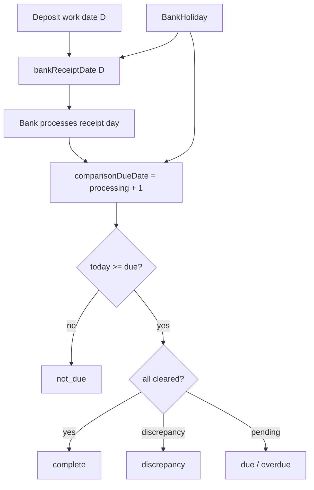

# Operations checklist (floating panel)

Design spec for a **global operations checklist** in Shift Close: derived completion from existing data, with **business-day due dates** that respect shift lag, bank processing delays, weekends, and **banking holidays**.

**Status:** Implemented v1 (2026-06-12). Floating panel, shift-close, deposit comparison, weekly Sunday tasks with in-progress acks.

**Related:** End of Day (`/days`, `lib/day-reports.ts`), deposit comparisons (`bankStatus`), reminders cron (`/api/reminders/check`), `lib/datetime-policy.ts` (`America/St_Lucia`).

---

## Goal

Give managers and accounting a **single always-visible panel** of operational tasks that must be done **today**, **soon**, or **by end of week**, with:

- **Green / complete** when underlying data satisfies the rule (not a manual checkbox app).
- **`in_progress`** when work has started but is not finished (weekly invoice entry on Sunday).
- **No false alarms** before work is realistically possible (shift lag, bank lag, holidays).
- **Escalation** (in-app badge → email → WhatsApp) only after due dates, reusing the reminders infrastructure.

---

## Locked decisions (summary)

| Topic | Decision |
|-------|----------|
| Shift “closed” / complete | End of Day rules only; **O/S disclosure does not affect** closed status |
| Scans | Required for shift-close when deposits/debits exist; **waived on station-closed days** (holidays) |
| Custom shift days (`7:30 - 2`) | Same **W + 1** entry rule; comparison only if deposit lines exist |
| Reopened shifts | **In scope** — must be re-closed; checklist stays incomplete |
| Deposit `discrepancy` | **Incomplete** until resolved (not green) |
| Weekly due day | **Sunday** — customer accounts and vendor invoices updated **on or before Sunday, at least once** per week |
| Weekly partial work | **`in_progress`** when started but not complete (Sunday invoice workflow) |
| Bank lag | Two-step: **bank receipt** → **processing day** → **comparison due** (see below) |
| Banking holidays | **Push back** receipt and processing (comparison stays `not_due`) |
| Station closed | No shift/scans expected; tasks **`na`** for that work date |
| Vocabulary | `complete`, `not_due`, `due`, `overdue`, `blocked`, `discrepancy`, `in_progress`, `na` |
| **Access** | **`admin` role or `isSuperAdmin` only** — not managers, operations managers, or supervisors |

---

## UX

### Placement

- **Floating panel** in `LayoutWrapper` (desktop + tablet): collapsed chip bottom-right, expands upward.
- **Hidden** on minimal mobile shells (attendance viewer, scans mobile, manager hub launcher).
- **Dashboard widget** (v1.1): same API payload; not a second data source.

### Collapsed state

- Chip shows **action count**: `due` + `overdue` only (`badgeWeight: 1`).
- `in_progress` and `not_due` do **not** increment the badge.
- Optional subtitle: highest-priority label (“Mon shifts overdue”, “Vendor invoices in progress”).

### Expanded state

| Section | Contents |
|---------|----------|
| **Due today** | Due date = today; not `complete` / `na` |
| **Due soon** | Due within next 2 calendar days; weekly items approaching Sunday |
| **This week** | Weekly tasks (customer accounts, vendor invoices); shows `in_progress` |

Each row: status icon, label, work date / week label, summary, deep link.

### Status colors

| Status | Meaning | Badge | Color |
|--------|---------|-------|-------|
| `complete` | Rule satisfied | No | Emerald |
| `not_due` | Bank / calendar lag | No | Slate muted |
| `in_progress` | Started, not finished (weekly) | No | Blue |
| `due` | Due today, incomplete | Yes | Amber |
| `overdue` | Past due | Yes | Amber → red if stale |
| `blocked` | Waiting on dependency | No | Slate |
| `discrepancy` | Exception needs resolution | Yes | Amber/red |
| `na` | Station closed / not applicable | No | Hidden or muted |

---

## Calendars

Two calendars (can share one table with `kind`):

### 1. `StationClosedDay`

Days the station did not operate (public holidays, planned closure).

- **Shift-close** for work date W → `na` (no 6-1/1-9 expected).
- **Scans** not required.
- **Deposit comparison** for W → `na` if no shifts/deposits exist.

### 2. `BankHoliday`

Days the bank does not process deposits (public holidays, etc.).

- Pushes **`bankReceiptDate`** and **`comparisonDueDate`** forward to the next banking day.
- While waiting on a holiday, comparison stays **`not_due`**.

**Implementation:** `lib/banking-calendar.ts` (or settings-backed list) with helpers `nextBankingDay(ymd)`, `isBankHoliday(ymd)`, `isStationClosed(ymd)`. Seed with St Lucia public holidays; admin UI later.

---

## Time policy

All dates use **`businessTodayYmd()`** and **`addCalendarDaysYmd()`** from `lib/datetime-policy.ts`. No raw `Date` string slicing.

### A. Shift close (data + scans)

**Entry due date:** shift work for calendar day **W** is due on **W + 1** (last shift still running on W).

```
shiftEntryDueDate(W) = addCalendarDaysYmd(W, 1)
```

**Station closed on W:** status `na` — no entry expected.

**Completion** (once `today >= shiftEntryDueDate(W)` and not `na`):

| Check | Required |
|-------|----------|
| Day complete (EOD) | `DayReport.status === 'Complete'` (standard 6-1 + 1-9 closed, no draft) **or** valid **Custom** single-shift day |
| O/S disclosed | **Not required** for closed / complete |
| Scans | Deposit scans if deposit amounts &gt; 0; debit scans if day-sheet debit/credit or scans expected; security scans per existing EOD rules |
| Scan waiver | `securityScanDayWaiver` or station closed on W |
| Reopened | No shift on W with `status === 'reopened'` |
| Missing slip | No open `missingDepositSlipAlert` for W (when deposits exist) |

**Before `shiftEntryDueDate(W)`:** `not_due` (e.g. Tuesday AM: Monday `due`, Tuesday `not_due`).

**Rolling window:** last **7** calendar days (configurable) for catch-up overdue.

---

### B. Bank deposit comparison

**Model (locked):** Deposits are not comparable on the shift/deposit date. They **reach the bank** on a **receipt day**, the bank **processes** that day (if open), and comparison is **due the following calendar day** when data is available.

```
bankReceiptDate(D):
  if D is Friday, Saturday, or Sunday:
    → next banking Monday (skip bank holidays)
  else:
    → addCalendarDaysYmd(D, 1)   // Mon shift deposits → bank Tuesday, etc.
    → if result is bank holiday, → nextBankingDay

comparisonDueDate(D):
  processingDay = bankReceiptDate(D)
  if processingDay is bank holiday → processingDay = nextBankingDay(processingDay)
  → addCalendarDaysYmd(processingDay, 1)
  → if result is bank holiday / non-processing weekend → nextBankingDay
```

**Narrative**

- **Fri / Sat / Sun** deposits → bank **Monday** → process Monday → available **Tuesday** → due **Tuesday**.
- **Monday** deposits → bank **Tuesday** → process Tuesday → available **Wednesday** → due **Wednesday**.
- **Tuesday** deposits → bank **Wednesday** → due **Thursday**; and so on (+2 calendar days from work date when both station and bank run normally).

**Examples** (no holidays):

| Work / deposit date (D) | Bank receipt | Comparison due |
|-------------------------|--------------|------------------|
| Friday | Monday | Tuesday |
| Saturday | Monday | Tuesday |
| Sunday | Monday | Tuesday |
| Monday | Tuesday | Wednesday |
| Tuesday | Wednesday | Thursday |
| Wednesday | Thursday | Friday |
| Thursday | Friday | Monday* |

\*Friday receipt → Monday processing (weekend) → due **Tuesday**; holiday helper resolves edge cases.

**With banking holiday on Tuesday:** Monday deposits received Tuesday (holiday) → receipt pushes to Wednesday → due Thursday.

**Completion** (once `today >= comparisonDueDate(D)` and not `na`):

- All deposit and day-sheet debit lines for D: `bankStatus === 'cleared'`.
- Any `discrepancy` → status **`discrepancy`** (counts toward badge until resolved).

**Before due date:** `not_due`.

**Dependencies:** Shifts for D **closed** (not draft). Else `blocked` (“Waiting on shift close”).

---

### C. Weekly tasks (Sunday due)

**Tasks:** `customer-accounts`, `vendor-invoices`

**Week boundary:** Sunday-ending week (Mon–Sun). **Due date:** Sunday of that week (`weekDueDate`).

**Requirement:** Module updated **at least once on or before Sunday** each week, and completion criteria met.

#### Customer accounts

- **Complete:** AR summary row for active period has `updatedAt` within current week (Mon–Sun) and passes validation (non-empty / saved).
- **In progress:** User clicked **Mark in progress** this week, or `updatedAt` this week but validation fails.
- **Not started:** No `updatedAt` this week; before Sunday → shown in **This week**; on Sunday → `due`; after Sunday → `overdue`.

#### Vendor invoices

Typical workflow: **Sunday** manual entry of all invoices; may pause mid-session.

- **Complete:** Completion rule met for the week (e.g. no required pending backlog **and** at least one save/import this week **or** explicit **Mark complete**).
- **In progress:** `ChecklistAcknowledgement` kind `started` for `(taskId, weekKey)`, **or** invoices created/updated this week but completion rule not met.
- **Not started:** No activity this week.

**UI actions (weekly rows):**

- **Mark in progress** — sets `started` with `weekKey`, optional note (“entered 12 of ~40 invoices”).
- **Mark complete** — only when rule satisfied or manager override with note.

`in_progress` visible in panel all week; becomes `due` on Sunday if still incomplete; `overdue` after Sunday.

---

### D. Other tasks (v1.1+)

| Task | Cadence | Due | Completion |
|------|---------|-----|------------|
| Cashbook review | Daily | `shiftEntryDueDate(W)` | Auto-sync present; optional manual ack |
| Fuel balance | Daily | Shift entry due | Balance `updatedAt` for period |
| Cashed checks | Conditional | Payment + 1 | `clearedAt` on check batches |
| Rubis EFT | Conditional | Configurable | Payment batch recorded |

---

## Task catalog

| ID | Label | Bucket | Depends on |
|----|-------|--------|------------|
| `shift-close` | Update shift (data, scans) | Rolling daily | — |
| `deposit-comparison` | Bank deposit & comparison | Rolling daily | `shift-close` |
| `cashbook-review` | Review cashbook | Daily | `shift-close` |
| `fuel-balance` | Update fuel balance | Daily | `shift-close` (soft) |
| `cashed-checks` | Capture cashed checks | Conditional | — |
| `rubis-eft` | Record Rubis payments (EFT) | Conditional | invoices |
| `customer-accounts` | Update customer accounts | Weekly (Sun) | — |
| `vendor-invoices` | Update vendor invoices | Weekly (Sun) | — |

---

## Dependencies

```
shift-close → deposit-comparison
shift-close → cashbook-review
shift-close → fuel-balance (soft)
```

Blocked = visible, muted, still clickable.

---

## Notifications

### In-app

- Poll `GET /api/operations-checklist` every 3–5 min + tab focus.
- Badge = `due` + `overdue` + `discrepancy` only.

### Outbound (v2)

| Trigger | Channel |
|---------|---------|
| `overdue` ≥ 1 business day | Email |
| `overdue` ≥ 3 business days or `discrepancy` | WhatsApp |

Never notify for `not_due`, `na`, `in_progress`, or `complete`. Idempotent per `(taskId, workDate|weekKey, channel, day)`.

---

## API

### `GET /api/operations-checklist`

```ts
type ChecklistItemStatus =
  | 'complete'
  | 'not_due'
  | 'in_progress'
  | 'due'
  | 'overdue'
  | 'blocked'
  | 'discrepancy'
  | 'na'

type ChecklistItem = {
  id: string
  label: string
  section: 'today' | 'soon' | 'week'
  status: ChecklistItemStatus
  workDate?: string       // YMD for daily tasks
  weekKey?: string        // e.g. 2026-W23 for weekly tasks
  dueDate?: string
  summary?: string
  href: string
  blockedBy?: string[]
  badgeWeight: 0 | 1
  actions?: ('mark_in_progress' | 'mark_complete' | 'snooze')[]
}

type OperationsChecklistPayload = {
  asOf: string
  items: ChecklistItem[]
  counts: {
    due: number
    overdue: number
    inProgress: number
    notDue: number
    complete: number
  }
}
```

### `POST /api/operations-checklist/ack` (v1 for weekly)

Body: `{ taskId, weekKey, kind: 'started' | 'complete' | 'snooze' | 'waive', note?, untilDate? }`

### Helpers

`lib/operations-checklist-due-dates.ts`:

- `shiftEntryDueDate(W)`
- `bankReceiptDate(D)` — uses `BankHoliday`
- `depositComparisonDueDate(D)` — uses `BankHoliday`
- `weekDueDate(weekKey)` → Sunday
- `currentWeekKey(asOf?)`

`lib/banking-calendar.ts` — holiday lists + `nextBankingDay`.

**Tests:** table-driven cases for weekend batch, Mon→Wed, Tue→Thu, holiday pushback.

---

## Phased rollout

| Phase | Scope |
|-------|-------|
| **v1** | Panel; `shift-close` + `deposit-comparison`; calendars (seed holidays); due-date helpers |
| **v1.1** | Weekly Sunday tasks + `in_progress`; cashbook / fuel; dashboard widget |
| **v2** | Ack API, email escalation, snooze/waive |
| **v3** | Admin holiday editor, role-based task sets |

---

## Remaining open decisions

1. **Time-of-day cutoff:** Due at start of business day vs fixed handoff time (e.g. 10:00 AM `America/St_Lucia`).
2. **Saturday shift entry due Sunday:** Weekend email notifications or Monday only?
3. **Vendor invoices “complete” rule:** Strict (all vendors entered) vs pragmatic (user marks complete with note) — default: **mark complete** when user confirms; `in_progress` when partial.
4. **Cashbook:** Auto-sync only — task is “reviewed” via ack (v1.1).

---

## Test cases

**Shift entry**

- W=Mon → due Tue; Mon `not_due`, Tue `due` if incomplete.
- W on `StationClosedDay` → `na`.

**Deposit comparison (no holidays)**

- D=Fri → due Tue; Mon `not_due`.
- D=Mon → due Wed; Tue `not_due`, Wed `due`.
- D=Tue → due Thu.

**Bank holiday**

- Holiday on Tue → Mon deposits due Thu (receipt Wed, due Thu).

**Tuesday morning integration**

- Mon shift `due`; Tue shift `not_due`.
- Mon deposits `not_due` until Wed; Fri deposits `due` if Tue is comparison due day.

**Weekly**

- Sunday: vendor `in_progress` → `due` (badge); Monday → `overdue` if still incomplete.
- Activity Wed + complete rule met → `complete` (no badge).

---

## Reference diagram



---

## Changelog

| Date | Change |
|------|--------|
| 2026-06-12 | Initial spec |
| 2026-06-12 | **Locked:** bank receipt + processing lag (Fri–Sun→Tue; Mon→Wed; +2 pattern); Sunday weekly due; `in_progress`; O/S excluded from close; scans + station/bank holidays; reopened shifts; discrepancy = incomplete; custom days |
